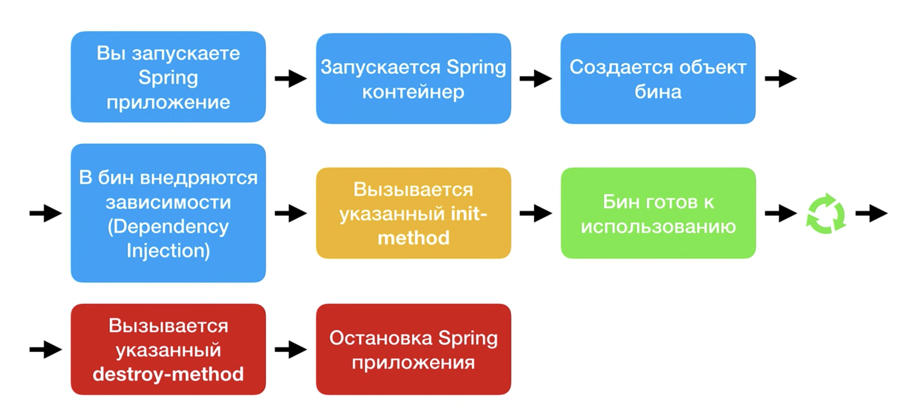

# Bean Lifecycle. Init, Destroy и Factory методы.

* init-method
    - логика, сопутствующая созданию бина;
    - метод, который запускается в ходе инициализации  бина;
    - инициализация ресурсов, обращение к внешним файлам, запуск БД;
* destroy-method 
    - логика, сопутствующая уничтожению бина;
    - метод, который запускается в ходе уничтожения бина (при завершении  приложения);
    - очищение ресурсов, закрытие потоков ввода-вывода, закрытие доступа к БД; 
* factory-method
    - патттерн программирования;
    - предлагает создавать объекты не напрямую, используяоператор `new`, а через вызов особого фабричного метода. Объекты все равно будут создаваться при помощи `new`, но делать это будет factory-method (https://refactoring.guru/ru/design-patterns/factory-method).  
   
Методы прописываются в теге `bean` после класса:
`<bean id="musicBean"
            class="ru.solomakhin.spring.RockMusic"
            init-method="doMyInit"
            destroy-method="doMyDestroy"
            factory-method="getRockMusic"">`

Методы `doMyInit()`, `doMyDestroy()` и `getClassicalMusic` создаются в классе бина (RockMusic).

### factory-method:
1. Ограничиваем создание объектов класса RapMusic() через `new`, создав пустой приватный конструктор;
2. Создаем метод - он должен быть статичным (вызываться на классе, а не на объекте) и возвращать объект выбранного класса (RapMusic);
3. Добавляем `factory-method` в applicationContext.xml;

### Тонкости:

1. У этих методов может быть любой модификатор доступа;
2. Может быть любой тип возвращаемого значения, но чаще всего используется void, так как нет возможности получить возвращаемое значение;
3. Название может бытьлюбым;
4. Эти методы НЕ должны принимать на вход какие-либо аргументы;
5. Для бинов со `scope="prototype"` Spring не вызывает destroy метод (Spring не берет на себя полный жизненный цикл бинов с prototype, просто отдает эти бины клиенту и больше о нихне заботится, в отличии от бинов singleton).
6. Несмотря на то, что при использовании factory-method со `scope="singleton"` при каждом вызове метод `getRapMusic()` должен возвращать новый объект класса, объект будет только один (Spring вызовет только один раз фабричный метод, при последующих `getBean()` Spring будет давать ссылку на этот ранее вызванный объект);

При нескольких разных вызовов `getBean()` (например, RockMusic и ClassicalMusic) сначала вызываются все init методы, потом действие, потом destroy методы.
Например, при нашем коде в консоле будет: 
>Init Rock
>
>Init Classic
>
>Rock
>
>Classic
>
>Destroy Classic
>
>Destroy Rock
>

При `scope="prototype"` количество init-методов будет равно количеству prototype-бинов.
